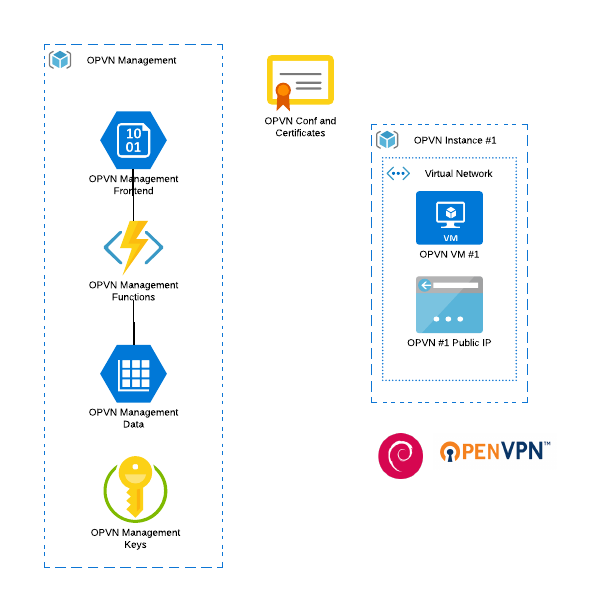

## openvpn-cloud-install
OpenVPN Cloud Install is a fork from the OpenVPN Install script created by [Nyr](https://github.com/Nyr).

The Cloud Install script is executed on the local client machine and will ask a range of questions to provision the resources in a cloud service provider (AWS or Azure), and set up your OpenVPN server.


The script will allow you to set up a VPN Server in the cloud for usage literally in a couple of minutes, just an account with one of the cloud providers.

*The initial idea of the project is to get a minimal viable product out that executes correctly, and then adjusting and improving on different aspects of the solution.  The main vision is to have the ability to spin up a VPN server when required, and spinning it down when not needed anymore. This would be for the road warriors out there that want to have control over their own VPN, but don't want to host with the current service providers out there.*

***This is a work in progress.***

### Installation

Execute the powershell script
```
./infrastructure-setup.ps1
```
The script will notify you that it is about to log into Azure via the browser.  Log into your Azure account, where your subscriptions will be loaded, where you can select the subscription you wish to use. 

### Architecture



There are two main areas of the OpenVPN Cloud Install solution
1. Management
2. OpenVPN Instance resource group

#### Management
A storage acocunt hosted website, using Azure AD authentication. The website is used to manage the OpenVPN instance metadata and user certificates for each.  You can then decide to spin up the infrastructure or destroy an environment.

#### OpenVPN Instance resource group
There can be zero to multiple resource groups. Each resource group will be linked to an instance that is managed within the management system.  I will only be instanciated when started up in the management solution.

### Donations

If you want to show your appreciation, you can donate to

#### Original Fork Developer Nyr
[PayPal](https://www.paypal.com/cgi-bin/webscr?cmd=_s-xclick&hosted_button_id=VBAYDL34Z7J6L) or [cryptocurrency](https://pastebin.com/raw/M2JJpQpC). Thanks!
